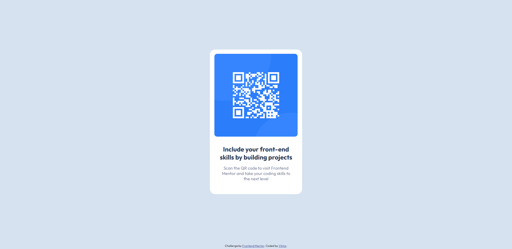

# Frontend Mentor - QR code component solution

This is a solution to the [QR code component challenge on Frontend Mentor](https://www.frontendmentor.io/challenges/qr-code-component-iux_sIO_H). Frontend Mentor challenges help you improve your coding skills by building realistic projects. 

## Table of contents

- [Overview](#overview)
  - [Screenshot](#screenshot)
  - [Links](#links)
- [My process](#my-process)
  - [Built with](#built-with)
  - [What I learned](#what-i-learned)
  - [Continued development](#continued-development)
  - [Useful resources](#useful-resources)
- [Author](#author)
- [Acknowledgments](#acknowledgments)

## Overview

### Screenshot

## My process

### Built with

- Semantic HTML5 markup
- CSS custom properties
- Flexbox

### What I learned

1. Used flexbox on main I can center the sections
2. Gave a background of white to both sections
3. Defined the width of the qr section but the picture this way moved so I had to make the qr section flex as well and center the image
4. The image got 95% width so there is a white outline
5. Defined the border radiuses
6. Gave the same width to the content section as well
7. Finished the rest of the styling

### Continued development

At first I used pixels then I was like this is not right and I started to use percentages so both flex and width needs more experience.

### Useful resources

Tried to figure it out by myself.

## Author

- Frontend Mentor - [@victorsonet](https://www.frontendmentor.io/profile/victorsonet)
- Twitter - [@GMLvictorsoN](https://twitter.com/GMLvictorsoN)
